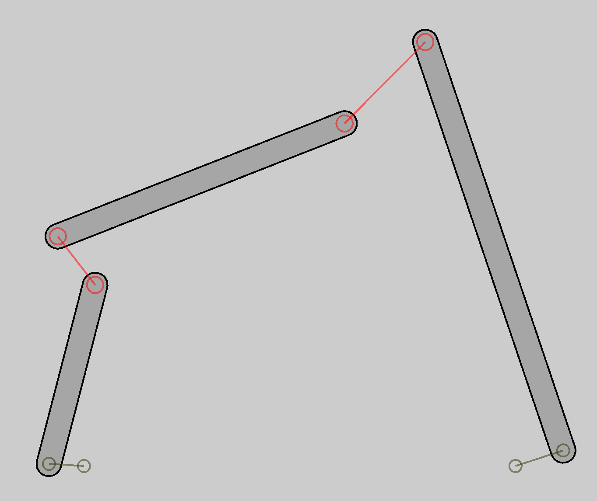
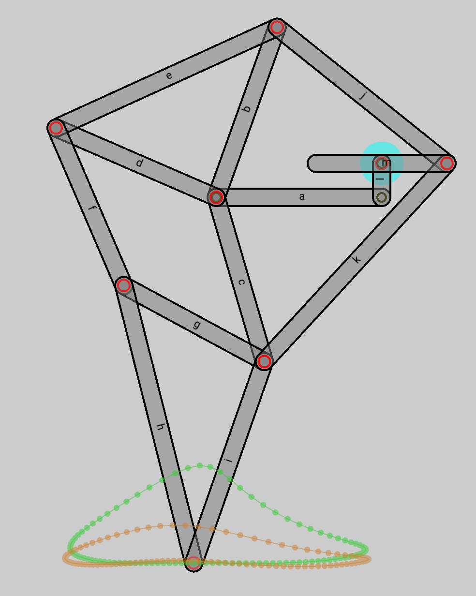

# Assignment 2 - Kinematics of Mechanisms

Please fill in your name and student id:

| First name: | Last name: | Student ID: |
| ----------- | ---------- | ----------- |
|  Nicola     |  Küng      | 15-920-184  |


Hint: calculate jacobian via chain-rule (dp/dx^T * dC/dp)

For a more readable version of this document, see [Readme.pdf](Readme.pdf).

**Deadline:** March 26th 2020, 1pm. Only commits ***pushed*** to github before this date and time will be considered for grading.

**Issues and questions:** Please use the [issue tracker](https://github.com/cmm-20/a2) of the starter code repository if you have any general issues or questions about this assignment. You can also use the issue tracker of your personal repository or [email me](mailto:moritzge@inf.ethz.ch).

## Assignment

In the first assignment, we implemented several optimization methods to solve unconstrained optimization problems, for example IK for a two-bar linkage. In this assignment we want to simulate more complex mechanisms using the same optimization methods.

### 1. Rigid-body kinematics

A mechanical linkage consists of 

- links of different length,
- hinge joints that connect two links,
- fixed joints that keep a point on a link fixed with respect to world coordinates,
- and fixed angle joints that enforce a fixed angle between a rigid body and the world. 

We will model a general class of mechanisms with rigid bodies and constraints that act between these rigid bodies. Here are the components of our simulation:



**Rigid bodies.** We will model the links as rigid bodies.  The position $x_{p, i}$ and rotation angle $\theta_{i}$ define the state $x_i = \{x_{p,i}, \theta_i\}$ of the rigid body $i$.

The world coordinates, $p_w$, of a point $p_l$, that is in local coordinates of a rigid body $i$, can be thus computed as:

$$
p_w(x_i) = x_{p,i} + R({\theta_i}) p_l
$$
where $R({\theta})$ is the rotation matrix corresponding to the rotation angle $\theta$.

**Hinge joints.** A hinge joint connects two rigid bodies $i$ and $j$ at attachment locations $p_i$ and $p_j$, which are in local coordinates of the corresponding rigid bodies, $i$ and $j$. For a hinge joint to be valid, we want the world coordinates of both attachment points to be equal:
$$
c_{h}(x_i, x_j) = p_{w}(x_i) - p_{w}(x_j) =0
$$
**Fixed joints.** Fixed joints ensure that a point $p_l$ in local coordinates of a rigid body $i$ has the world coordinates of the point $p_f$:
$$
c_{f}(x_i) = p_f - p_w(x_i)
$$

**Fixed angle joints ** force the relative angle of two rigid bodies $i$ and $j$ to be at a target angle $\theta_t$:
$$
c_a(x_i) = \theta_i - \theta_t
$$

We collect the states of all $n$ rigid bodies in the vector $x = \{x_0, x_1,…x_{n-1}\}$ and all constraints in the vector $c(x) = \{c_{h,0},…,c_{h,m_h-1}, c_{f,0},…, c_{f,m_f-1}, c_{a,0},…, c_{a,m_a-1}\}$, where $m_h$,  $m_f$,  $m_a$ are the number of hinge, fixed and fixed angle constraints. When running the simulation, we want to find a state $x$ that satisfies all constraints $c(x) = 0$. We achieve this by solving the following minimization problem:
$$
x = \text{argmin}_\tilde{x} \frac{1}{2}c(\tilde x)^Tc(\tilde x) = \text{argmin}_\tilde x f(\tilde x)
$$
In this assignment we will solve this using Newton's method and a Gauss-Newton approximation for the Hessian. 
$$
\begin{array}
_\nabla f(x) &= J(x)^Tc(x) \\
\nabla^2f(x) &= J(x)^TJ(x) \cancel{+ \sum_{i=0}^{m-1}c_i(x)\nabla^2c_i(x)}
\end{array}
$$
where $J(x) = \frac{\partial c}{\partial x}$ is the Jacobian of the constraints, and $\nabla^2c_i(x)$ is the Hessian of constraint $i$. We are omitting the second-order term in the Hessian for simplicity.

In the last assignment, you already implemented Newton's method. What you need to do in this assignment, is to compute the gradient $\nabla f$ and Hessian $\nabla^2 f$. Thus, we need to compute the Jacobian $J(x)$. We will split this up into different tasks.

**Task 1.1:**  The constraints of the hinge and the fixed joint both use the function $p_w(x_i)$. Therefore, compute the Jacobian $\frac{\partial p_w(x_i)}{\partial x_i}$. Note that this Jacobian is of size $[2,3]$, because $p_w(x_i)$ is of size two and $x_i$ of size three.

***Relevant code:*** $p_w(x_i)$ is a property of the rigid body, thus you can find the implementation of this function in `RigidBody.h`. Implement the function `dpWorld_dx`. The function `drotationMatrix_dtheta` returns $\frac{\partial R(\theta)}{\partial \theta}$. You can test your implementation by running the executable `src/tests/tests`, it should print `rigid body test: [PASSED]`.

**Task 1.2:** Now we can compute the Jacobians of the hinge and fixed joint constraints. Note that the Jacobian for the hinge joint has the following structure: $J_h(x_i, x_j) = [\frac{\partial c_h}{\partial x_i}, \frac{\partial c_h}{\partial x_j}]$ and is thus of size $[2,6]$, while the Jacobian for the fixed joint is of size $[2,3]$.

***Relevant code:*** In the file `Joint.h` you implement the methods `jacobian` for all three different joints. Make use of the previously implemented method `rb.dpWorld_dx` of the rigid body class. You can test your implementation by running the executable `src/tests/tests`, it should print

```bash
hinge joint test: [PASSED]
fixed joint test: [PASSED]
fixed angle joint test: [PASSED]
```

**Task 1.3:** Having implemented the Jacobians of all different types of constraints, we need to assemble them into the global Jacobian $J$. 

***Relevant code:*** In the file `KinematicEnergy.h`, the method `jacobian` computes the global Jacobian $J$ by iterating through all joints. In each for-loop, copy the Jacobians from the individual joints into the global Jacobian. The index `i` keeps track of how many constraints were already processed. Each rigid body has a field `dofIdx` which is the start index of the rigid body in the global state vector $x$. The elements `dCdx.block<1,3>(i, dofIdx)` are thus $\frac{\partial c_i}{\partial x_j}$, which is the derivative of constraint $i$ w.r.t the state $x_j$ of rigid body $j$, whose DOFs start at `dofIdx`. 
Again, you can test your implementation by running the executable `src/tests/tests`, it should print `simulation test: [PASSED]`. You can now also ran the app `src/app/app`, click "run simulation" and drag around rigid bodies. The linkage should behave as expected.

### 2. Design Optimization



Using the simulation, we now want to change the dimensions of the linkage to perform a certain task. We will use the famous Jansen leg mechanism. The goal is to find link lengths, such that the end-effector (or foot) of the Jansen leg tracks a target trajectory. 

**Task 2.1:** Run the app and select the Jansen mechanism. While the simulation is running, you can select a rigid body and change its length with the arrow up/down keys. The resulting trajectory (green) of the end-effector will change. Try your best to change the link length by hand, such that it matches the target trajectory (orange) best possible. Click the button "print link length" and report the result printed to `cout`.

*Your answer: the printed list of link lengths*

Link lengths:
 3.8
4.15
**4.13**
4.01
5.58
3.94
3.67
6.57
 4.9
   5
6.19
0.78
   3

**Task 2.2:** It probably took you some time to find a good approximation to the target trajectory. Let's now use random search to find the optimal link lengths $p$ to match the target trajectory $s_t$ with the trajectory generated by the mechanism $s(p)$. The objective function is thus 
$$
f_t( p ) = \min_{\tilde p}||s(p) - s_t||^2
$$

***Relevant code:*** Implement the method `evaluate` in the file `MechanismOptimizer` to return $f ( p)$. The class `MatchTrajectoryObjective`  has its own copy of the simulation `sim`. The method `sim.setDesignParameters(p)`  sets the link lengths $p$ and  `sim.recordTrajectory()` returns the trajectory as a matrix where each row contains the coordinates of the end-effector. You can also adjust the search region in the method `MechanismOptimizer::optimizeTrajectory()`.

What is the best mechanism your algorithm found? Click the button "print link length" and report the result printed to `cout`.

*Your answer: the printed list of link lengths*

Link lengths:
  4.0273
 4.03551
 4.08609
 4.28573
 5.45169
 4.15754
 3.95142
 7.16446
 4.84032
 4.63137
 6.26276
0.847845
  2.9291
  
---

---

## Setting things up

### Prerequisites

Make sure you install the following:

- Git (https://git-scm.com)
    + Windows: download installer from website
    + Linux: e.g. `sudo apt install git`
    + MacOS: e.g. `brew install git`
- CMake (https://cmake.org/)
    + Windows: download installer from website
    + Linux: e.g. `sudo apt install cmake`
    + MacOS: e.g. `brew install cmake`

### Building the code

On Windows, you can use Git Bash to perform the steps mentioned below.

1. Clone this repository and load submodules:
    ```
    git clone --recurse-submodules YOUR_GIT_URL
    ```
2. Make build folder and run cmake
    ```
    cd comp-fab-a0-XXX
    mkdir build && cd build
    cmake ..
    ```
3. Compile code and run executable
    - for MacOS and Linux:
        ```
        make
        ./src/app/app
        ```
    - for Windows: 
        * open `assignement0.sln` in Visual Studio
        * in the project explorer, right-click target "app" and set as startup app.
        * Hit F5!


### Some comments

- If you are new to git, there are many tutorials online, e.g. http://rogerdudler.github.io/git-guide/.

- You will not have to edit any CMake file, so no real understanding of CMake is required. You might however want to generate build files for your favorite editor/IDE: https://cmake.org/cmake/help/latest/manual/cmake-generators.7.html
