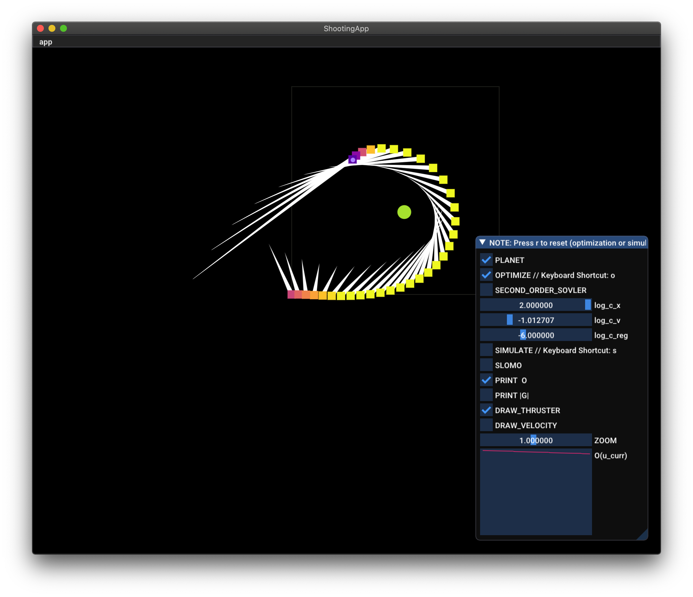
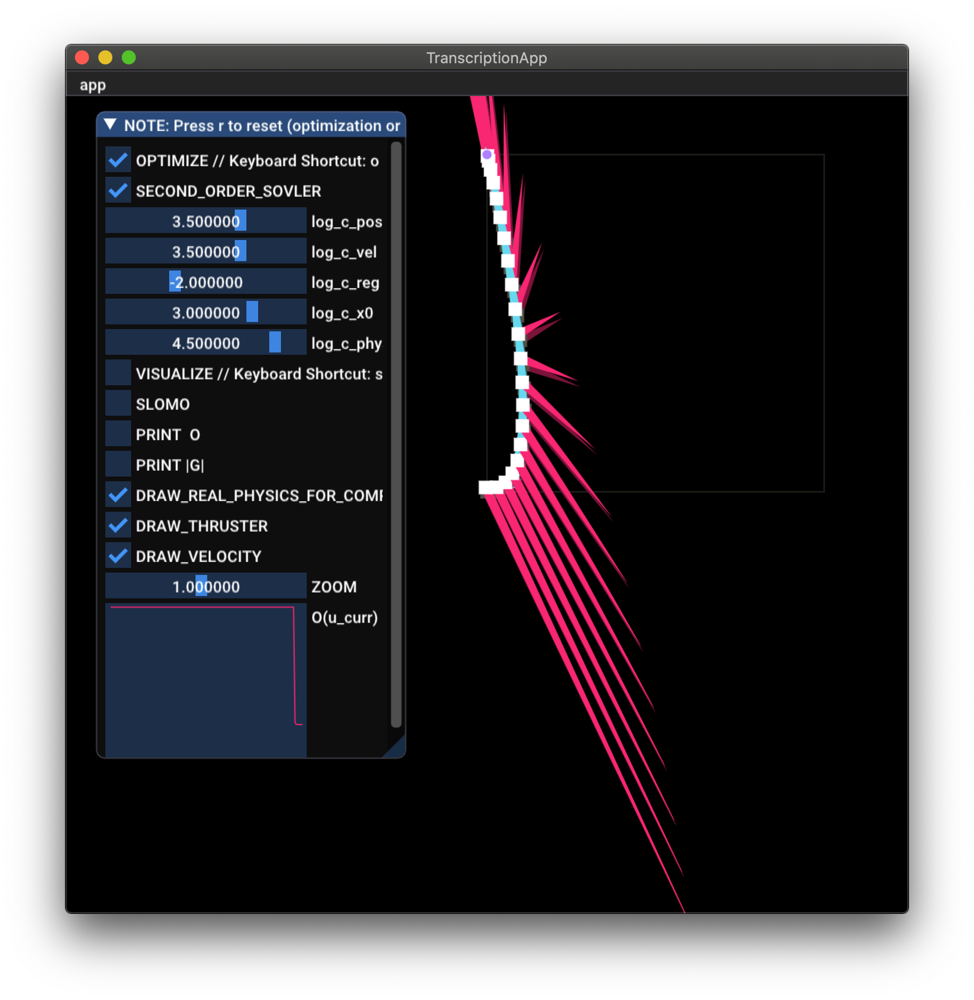
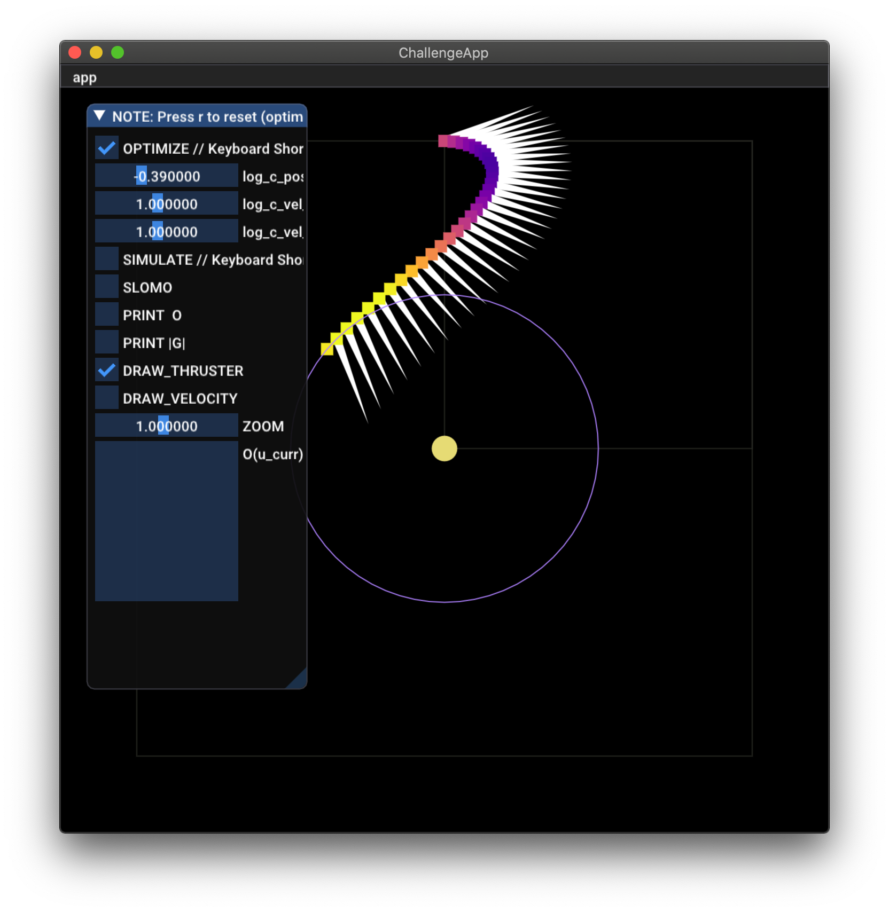
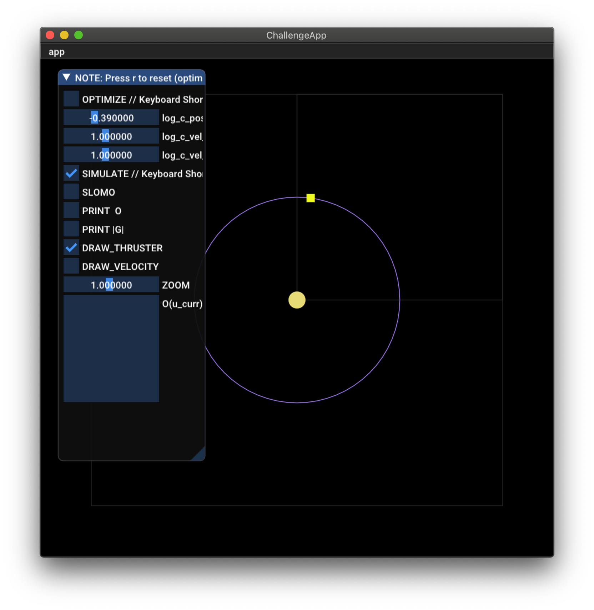

First Name: Nicola

Last Name: Küng

### Solution to Question 2:
From the hint follows `a_k = F_k/m`. Plugging into the second line of equation (3) on the hand-out yields
```
a_k = 1/h * (v_{k+1} - v_k).
```
Using the first line of equation (3) `v_k = 1/h * (x_{k+1} - x_k)`, we can substitute all `v` with `x`:
```
a_k = 1/h * ([1/h * (x_{k+2} - x{k+1})] - [1/h * (x_{k+1} - x_k)]).
```
Factoring out, we finally get
```
a_k = 1/h^2 * (x_{k+2} - 2 * x{k+1} + x_k).
````

### Solution to Question 5:
Inspecting printed vales of `O`, the number of steps needed by Newton's method to converge usually lies between 1 to 3. In contrast, gradient descent requires significantly more steps to converge, in the order of 100. 

The reason for the quick convergence of Newton's method lies in its computation of the direction (and step-length) for which the function converges the fastest in the current neighborhood of the solver (by undistorting the surrounding function landscape via the hessian).

### Solution to Question 7:

Note: The presence of a planet requires different weights for smooth convergence than regular use of the 'shooting-app'.

### Solution to Question 8:


### Solution to Question 9:
Gradient descent is stuck from the very beginning since the problem is numerically ill-conditioned: 

Similar to the given toy problem, direct transcription requires different optimization objectives (with different minima each) with weights of different orders of magnitude (e.g., _large_ weight on the objective on final position `x_k` vs. _small_ regularizer on `x`). The resulting function landscape for the optimization makes it nearly impossible for gradient descent to optimize all variables at the same time, especially when an objective with a large weight is already satisfied. Just like in the toy problem, trying a step in the gradient direction will yield a larger value of the objective, even if the step-length is halved 15 times. Only a much smaller step-length would alleviate the problem, but then convergences for another variable will suffer...

`TLDR`; Gradient descent can become numerically ill-conditioned because its step-length cannot take into account that the gradients for different dimensions have hugely different orders of magnitude.

### Explanation of your approach to Question 10 (required for full credit):
(Having been an attentive student of _Dynamics_) I knew 3 conditions need be strictly fulfilled to fly on a circular trajectory: 
- the final **position** must be on the ring
- the **direction** of the final **velocity** must be tangential to the ring
- the **magnitude** of the final **velocity** must be adjusted to the desired centripetal force

However, the simulation has proven me wrong and [I didn't get a perfectly circular trajectory](https://github.com/printablealice/a4/issues/1#issuecomment-621959259) – no matter the weights.

So, I reconsidered my strategy and realized, there's a much simpler solution to the problem: Constraining the shuttle's position to lie on the ring for some timesteps *after* the controlled trajectory (of 32 timesteps) wouldn't even require any inclusion of the shuttle's velocity in the math! 

Accordingly, my code now penalizes the shuttle's position for (an arbitrary) 100 "future" timesteps if it doesn't lie on the desired orbit around the sun. This directly ensures the shuttle's velocity to meet the above criteria.

Now, this method eventually yields a perfectly round trajectory, but – even after extensive tuning – it takes reeeeeaaaaalllllyyyy long for the optimizer to converge. Better be patient ;)


After a couple of minutes optimizing...


...finally simulating!

---

Assignment writeup: http://crl.ethz.ch/teaching/computational-motion-20/slides/tutorial-a4.pdf

---

1. Clone this repository.
    ```
    git clone YOUR_GIT_URL
    ```
2. Make build folder and run cmake
    ```
    cd a4
    mkdir build && cd build
    cmake ..
    ```
    - NOTE: Windows users can also try double-clicking runCMakeVisualStudio.cmd instead
    - NOTE: Don't forget to switch to Release mode or it's gonna be just unimaginably slow.
3. Compile code and run executable
